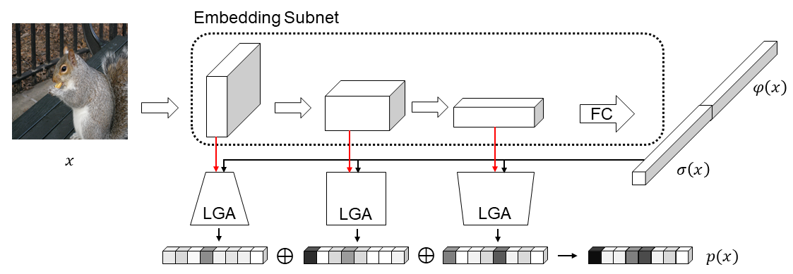
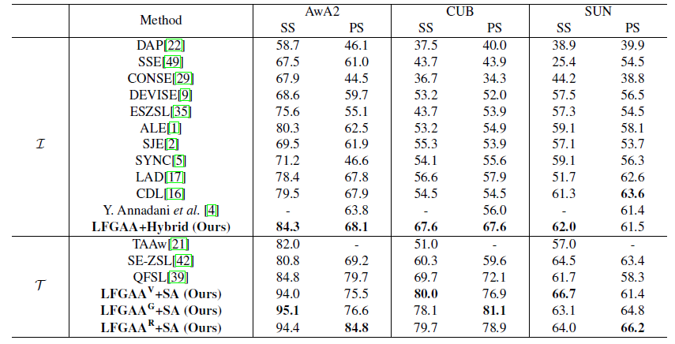
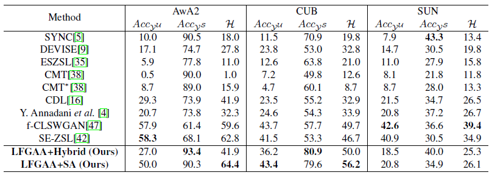

# Attribute Attention for in Zero-Shot Learning

This repository contains the public release of the Python implementation of

**Attribute Attention for Semantic Disambiguation in Zero-Shot Learning**

Yang Liu, Jishun Guo, Deng Cai, Xiaofei He.



If you use this code or find this work useful for your research, please cite:

```
@inproceedings{Liu_2019_ICCV,
  title={Attribute Attention for Semantic Disambiguation in Zero-Shot Learning},
  author={Liu, Yang and Guo, Jishun and Cai, Deng and He, Xiaofei},
  booktitle={The IEEE International Conference on Computer Vision (ICCV)},
  month={Oct},
  year={2019}
}
```

## Performance

### cZSL



### gZSL



## Start Up

Implemented and tested on Ubuntu 16.04 with Python 3.6 and Pytorch 1.0.1. Experiments are conducted on [AwA2](https://cvml.ist.ac.at/AwA2/), [CUB](http://www.vision.caltech.edu/visipedia/CUB-200.html) and [SUN](http://cs.brown.edu/~gmpatter/sunattributes.html) datasets.

We use AwA2 file format as default detailed in `./data/` folder and images should be downloaded and renamed as `./data/*/JPEGImages`. It is important to note that several cusomization work should be done for SUN dataset to maintain the same file format.

## Basic Usage

### Train

Use `experiments/run_trainer.py` to train the network. Run `help` to view all the possible parameters. We provide several config files under `./configs/` folder. Example usage:

```
python experiments/run_trainer.py --cfg ./configs/self_adaptation/VGG19_AwA2_PS_C.yaml
```

Feel free to download the reported [checkpoints](https://drive.google.com/open?id=1mRO54hifHr4UW7D5oQ6D7lWzI4K4b5m2).

### Test

Use `experiments/run_evaluator.py` to evaluate the network with self_adaptation and `experiments/run_evaluator_hybrid.py` with hybrid method.
